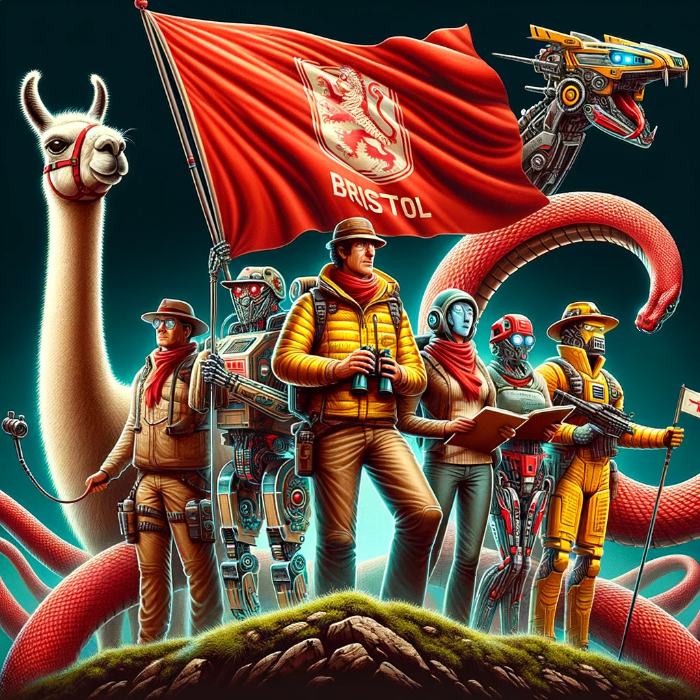

# Reading Group on Generative Models
Prompt: "Make an image with 10 people in the middle acting like explores and holding a red "Bristol" flag. Around them, I want a Llama, a Mamba, and a Transformer. Give it an Indiana Jones feel."

### Past Papers
Some of the dates are probably incorrect because I still haven't learned how to read a calendar.

| Title                                                                                                                                                                                                                                                                                                                                                                                                      | Date       | Topic                 |
|------------------------------------------------------------------------------------------------------------------------------------------------------------------------------------------------------------------------------------------------------------------------------------------------------------------------------------------------------------------------------------------------------------|------------|-----------------------|
| [Nearly d-Linear Convergence Bounds for Diffusion Models via Stochastic Localization](https://arxiv.org/abs/2308.03686)                                                                                                                                                                                                                                                                                    | 25/08/2023 | Diffusions            |
| [Score Approximation, Estimation and Distribution Recovery of Diffusion Models on Low-Dimensional Data](https://arxiv.org/abs/2302.07194)                                                                                                                                                                                                                                                                  | 1/09/2023  | Diffusions            |
| [Cold Diffusion: Inverting Arbitrary Image Transforms Without Noise](https://arxiv.org/abs/2208.09392)                                                                                                                                                                                                                                                                                                     | 6/09/2023  | Diffusions            |
| [Improving and generalizing flow-based generative models with minibatch optimal transport](https://arxiv.org/abs/2302.00482)                                                                                                                                                                                                                                                                               | 11/09/2023 | Flows                 |
| [Simulation-free Schrödinger bridges via score and flow matching](https://arxiv.org/abs/2307.03672)                                                                                                                                                                                                                                                                                                        | 15/09/2023 | Flows                 |
| [Trans-Dimensional Generative Modeling via Jump Diffusion Models](https://arxiv.org/abs/2305.16261)                                                                                                                                                                                                                                                                                                        | 3/10/2023  | Diffusion             |
| [Stochastic Interpolants: A Unifying Framework for Flows and Diffusions](https://arxiv.org/abs/2303.08797)                                                                                                                                                                                                                                                                                                 | 5/10/2023  | Diffusions, Flows     |
| [Convergence of denoising diffusion models under the manifold hypothesis](https://openreview.net/pdf?id=MhK5aXo3gB)                                                                                                                                                                                                                                                                                        | 12/10/2023 | Diffusions, Manifolds |
| [Consistency Trajectory Models: Learning Probability Flow ODE Trajectory of Diffusion](https://arxiv.org/abs/2310.02279)                                                                                                                                                                                                                                                                                   | 17/10/2023 | Diffusions, Flows     |
| [Building Normalizing Flows with Stochastic Interpolants](https://arxiv.org/abs/2209.15571) and [A Unifying Framework for Flows and Diffusions](https://arxiv.org/abs/2303.08797)                                                                                                                                                                                                                          | 19/10/2023 | Diffusions            |
| [Optimal Transport in Systems and Control](https://www.annualreviews.org/doi/full/10.1146/annurev-control-070220-100858)                                                                                                                                                                                                                                                                                   | 24/10/2023 | Optimal Transport     |
| [Particle Guidance: non-I.I.D. Diverse Sampling with Diffusion Models](https://arxiv.org/abs/2310.13102)                                                                                                                                                                                                                                                                                                   | 27/10/2023 | Diffusions            |
| [Generalization in diffusion models arises from geometry-adaptive harmonic representation](https://arxiv.org/abs/2310.02557)                                                                                                                                                                                                                                                                               | 02/11/2023 | Diffusions            |
| [ROBUST AND INTERPRETABLE BLIND IMAGE DENOISING VIA BIAS-FREE CONVOLUTIONAL NEURAL NETWORKS](https://arxiv.org/abs/1906.05478)                                                                                                                                                                                                                                                                             | 06/11/2023 | Diffusions            |
| [Diffusion Schrödinger Bridge Matching](https://arxiv.org/abs/2303.16852)                                                                                                                                                                                                                                                                                                                                 | 14/11/2023 | Diffusions            |
| [Chain of Log-Concave Markov Chains](https://arxiv.org/abs/2305.19473)                                                                                                                                                                                                                                                                                                                                     | 21/11/2023 | Log-Concave           |
| [Martingale posterior distributions](https://arxiv.org/abs/2103.15671)                                                                                                                                                                                                                                                                                                                                     | 23/11/2023 | Sampling              |
| [Multimeasurement Generative Models](https://openreview.net/forum?id=QRX0nCX_gk)                                                                                                                                                                                                                                                                                                                           | 05/12/2023 | Generative Models     |
| [Deep Networks as Denoising Algorithms: Sample-Efficient Learning of Diffusion Models in High-Dimensional Graphical Models](https://arxiv.org/abs/2309.11420)                                                                                                                                                                                                                                              | 11/01/2024 | Diffusions |
 | [Analysis of learning a flow-based generative model from limited sample complexity](https://arxiv.org/abs/2310.03575)                                                                                                                                                                                                                                                                                      | 12/01/2024 | Flows |
| [Sampling with Mirrored Stein Operators](https://arxiv.org/abs/2106.12506)                                                                                                                                                                                                                                                          | 18/01/2024 | Transformers |
| [A mathematical perspective on Transformers](https://arxiv.org/abs/2312.10794)                                                                                                                                                                                                                                                                                                                             | 25/01/2024 | Transformers |
 | [The emergence of clusters in self-attention dynamics](https://arxiv.org/abs/2305.05465)                                                                                                                                                                                                                                                                                                                   | 30/01/2024 | Transformers |
| [BERT: Pre-training of Deep Bidirectional Transformers for Language Understanding](https://arxiv.org/abs/1810.04805) and [The Illustrated BERT](https://jalammar.github.io/illustrated-bert/) and [Language Models are Few-Shot Learners](https://arxiv.org/abs/2005.14165) and [Tutorial 14 Transformers I](https://www.borealisai.com/research-blogs/tutorial-14-transformers-i-introduction/#Motivation) | 05/02/2024 | Transformers |
| [Dynamical Regimes of Diffusion Models](https://arxiv.org/abs/2402.18491)                                                                                                                                                                                                                                                                                                                                  | 01/03/2024 | Diffusions |
| [Diffusive Gibbs Sampling](https://arxiv.org/abs/2402.03008)                                                                                                                                                                                                                                                                                                                                               | 08/02/2024 | Diffusions |
| [Latent Attention for Linear Time Transformers](https://arxiv.org/abs/2402.17512)                                                                                                                                                                                                                                                                                                                          | 05/03/2024 | Transformers |
| [Implicit Diffusion: Efficient Optimization through Stochastic Sampling](https://arxiv.org/abs/2402.05468)                                                                                                                                                                                                                                                                                                 | 07/03/2024 | Diffusions |
| [Efficiently Modeling Long Sequences with Structured State Spaces](https://arxiv.org/abs/2111.00396) and [How to Train Your HiPPO: State Space Models with Generalized Orthogonal Basis Projections](https://arxiv.org/abs/2206.12037)                                                                                                                                                                     | 12/03/2024 | Transformers |
| [Formal Algorithms for Transformers](https://arxiv.org/abs/2207.09238)  | 15/03/2024 | Transformers |
| [An Introduction to Transformers](https://arxiv.org/pdf/2304.10557.pdf) | 19/03/2024 | Transformers |
| [Flow Matching for Generative Modelling](https://arxiv.org/abs/2210.02747v2) | 21/03/2024 | Flows |
| [RecurrentGemma: Moving Past Transformers for Efficient Open Language Models](https://arxiv.org/abs/2404.07839) | 16/04/2024 | Transformers |

### Additional Resources
Tutorials, videos, courses and notes that were shared at various times during the reading group.
- [Attention is all you need - Lukasz Kaiser Masterclass](https://www.youtube.com/watch?v=rBCqOTEfxvg)
- [Berkeley Deep Neural Networks Course](https://inst.eecs.berkeley.edu/~cs182/sp23/) and [related video](https://www.youtube.com/watch?v=csdc-KHjEMg&list=PLnocShPlK-Fs_62EXCDykgtQFbHGLMT7U&index=16)
- [Stable Diffusions](https://arxiv.org/abs/2112.10752) 
- [The Creativity of Text-to-Image Generation](https://arxiv.org/abs/2206.02904)
- [Deep Learning Foundations to Stable Diffusions - Jeremy Howard video](https://www.youtube.com/watch?v=_7rMfsA24Ls)
- [The Illustrated Stable Diffusion](http://jalammar.github.io/illustrated-stable-diffusion/)
- [Cross Attention augmented U-net](https://twitter.com/vtabbott_/status/1746475052030435649)
- [The Illustrated GPT-2](http://jalammar.github.io/illustrated-gpt2/)
- [On the Expressivity Role of LayerNorm in Transformers' Attention](https://arxiv.org/abs/2305.02582)
- [The Annotated S4](https://srush.github.io/annotated-s4/)
- [AlphaFold Meets Flow Matching for Generating Protein Ensembles](https://arxiv.org/pdf/2402.04845.pdf)
- [Repo - Formal Algorithms for Transformers](https://github.com/myazdani/formal-algorithms-for-transformers/tree/main)
- [But what is a GPT? Visual intro to transformers - 3B1B](https://youtu.be/wjZofJX0v4M?si=47bs8JLowglfFUIp)
- [Attention in Transformers, visually explained - 3B1B](https://youtu.be/eMlx5fFNoYc?si=RFzIfJyXwTvWWhKC)

### How to start

1. Transformers
   - [An Introduction to Transformers](https://arxiv.org/abs/2304.10557) by Turner is perhaps the best way to start with attention, it is simple, to the point and gives you the "shape" of each array, which is helpful at first.
   - After Turner's paper, I would read [A survey of transformers](https://arxiv.org/abs/2106.04554). There are typos but I found that this paper was helpful in giving a general overview: each paper implements them slightly differently and that made it very confusing for me. 
   - You will likely still be confused after this paper, so I would recommend [Formal Algorithm for Transformers](https://arxiv.org/abs/2207.09238).
   - I would then watch various of Andrey Karpathy's videos to consolidate understanding such as [this](https://www.youtube.com/watch?v=zjkBMFhNj_g) and [this](https://www.youtube.com/watch?v=zduSFxRajkE) and [this](https://www.youtube.com/watch?v=kCc8FmEb1nY&t=485s).
6. Diffusions
   - To do

### Suggesting new papers
You can suggest new papers [here](https://forms.gle/S2nhtZDcuekZrY4c6).

